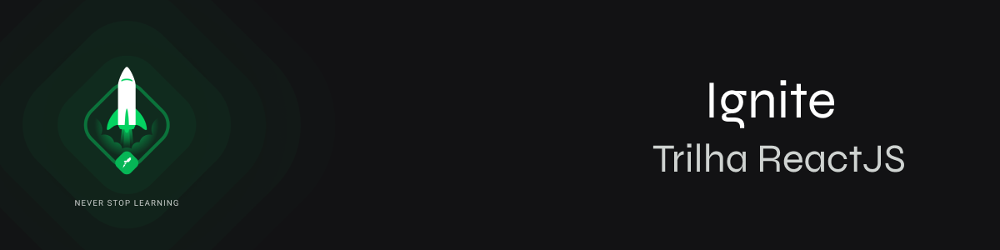

<h2 align="center">
  Ignite ReactJS (2022) - Em andamento!
</h2>

## Sobre

O Ignite é um programa feito pela [Rocketseat](https://rocketseat.com.br) de aceleração para devs, focado em preparar profissionais completos(as) para o mercado, treinando skills técnicas e comportamentais de forma intensiva e prática. O Ignite é dividido em trilhas de conhecimento não-dependentes onde nos aprofundamos em uma tecnologia específica. Em resumo, o objetivo do Ignite é desenvolver habilidades que vão acelerar sua carreira através de uma metodologia de aprendizado eficiente, um currículo alinhado às necessidades do mercado e as atitudes que vão te ajudar a se destacar como profissional.

Feito com 💜 &nbsp;por Lucas Lira 👋 &nbsp;[Mande um Aló](https://www.linkedin.com/in/lucas-lira-dev/)
